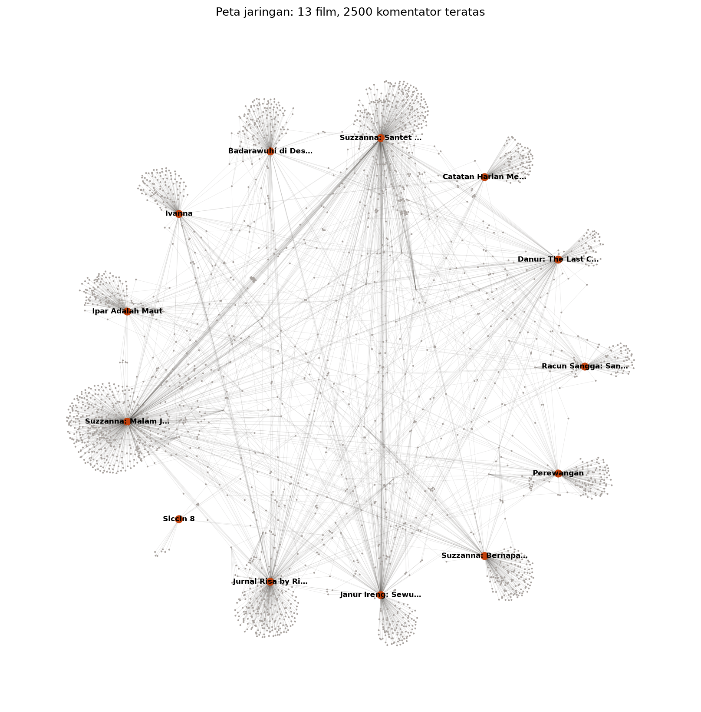

<div align="center">

# 🕯️ SANTET

**Sentiment Analysis for Nusantara Theatrical Expectation Tracking**

*Membaca "mantra" warganet sebelum film tayang.*

[](https://santet-soraya-film-explorer-vw6emk9y9yavz2cxuaghkj.streamlit.app/)




</div>

---

## Temuan utama

> Model sentimen standar membaca **51,2%** komentar trailer horor sebagai negatif.
> Leksikon yang paham horor hanya menemukan **10,0%**.
> "Merinding" dan "serem banget" adalah pujian, bukan keluhan.

| | |
| --- | --- |
| Film | 15 judul, 2017–2026, 5 rumah produksi |
| Komentar trailer | ~9 ribu komentar YouTube, akun dianonimkan `user_<hash12>` |
| Jaringan | 5.653 akun · 7.431 sisi · 13 komunitas Louvain |
| Status validasi | Sentimen IndoBERT **belum** divalidasi manual — lihat [`results/paper_status.md`](results/paper_status.md) |

Angka di atas dihasilkan oleh `./bit web stats`, bukan diketik tangan.

## Coba sekarang

| Halaman | Isi |
| --- | --- |
| [🕯️ Cerita SANTET](https://santet-soraya-film-explorer-vw6emk9y9yavz2cxuaghkj.streamlit.app/) | Prolog sampai Epilog: kenapa "takut" berarti datang |
| [🕸️ Dashboard jaringan](https://santet-soraya-film-explorer-vw6emk9y9yavz2cxuaghkj.streamlit.app/app) | 20 analisis SNA, unduh CSV · GraphML · NodeXL |

## Jalankan di komputer sendiri

```bash
git clone https://github.com/indri007/SANTET-soraya-film-explorer.git
cd SANTET-soraya-film-explorer
python -m venv .venv && source .venv/bin/activate
pip install -r requirements.txt

./bit web check    # repo siap?
./bit validate     # data sesuai skema?
./bit web run      # buka http://localhost:8501
```

Pipeline berat (crawling, IndoBERT, Louvain) memakai `requirements-pipeline.txt` dan tidak dibutuhkan untuk menjalankan app.

## Struktur repo

```text
streamlit_app.py            entrypoint Streamlit Cloud (router st.navigation)
santet_hero.py              hero landing Material 3 (video + chip angka dari data)
santet_m3.py                tema Material 3: token warna, tipografi, komponen
bit                         semua perintah; grup web: ./bit web check · validate · stats · run · hero · deploy
santet_web.py               mesin perintah ./bit web
santet_schema.py            skema data + validator
.streamlit/config.toml      tema gelap SANTET
streamlit_app/
├── app.py                  dashboard SNA (20 analisis)
├── pages/01_📖_Cerita.py   halaman cerita
└── assets/hero.mp4         video latar (< 8 MB)
data/films_clean.csv        1 baris per film
results/sna_<waktu>/        NN_<slug>.csv/png/graphml · ringkasan.md · nodexl/
```

## Data & etika

- Komentar diambil dari trailer YouTube publik. Nama, handle, dan channel ID komentator **tidak** disimpan; setiap akun di-hash dengan salt rahasia yang tidak pernah di-commit.
- Data mentah hasil crawling diabaikan git (UU PDP No. 27/2022).
- Riset akademik independen. **Tidak berafiliasi** dengan Soraya Intercine Films, Hitmaker Studios, atau MD Pictures.

## Sitasi

```bibtex
@software{santet_2026,
  author    = {Sari, Indri Anjar Kartika},
  title     = {SANTET: Sentiment Analysis for Nusantara Theatrical Expectation Tracking},
  year      = {2026},
  publisher = {GitHub},
  url       = {https://github.com/indri007/SANTET-soraya-film-explorer}
}
```

## Kontribusi

Baca [`CONTRIBUTING.md`](CONTRIBUTING.md). Ringkasnya: `./bit deploy` harus lulus sebelum push ke `main`.
